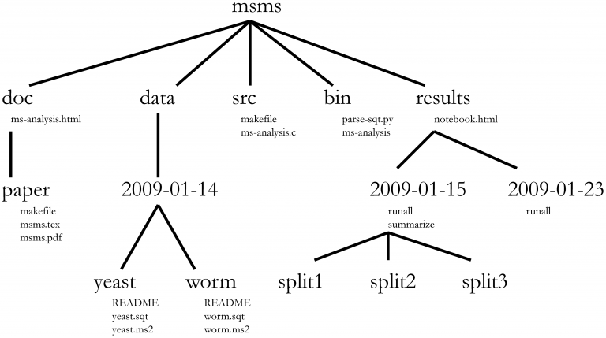

# (computational) biological analysis folder structure
This repository/cookiecutter is our attempt to standardize project structures in our lab. It uses [cookiecutter](https://cookiecutter.readthedocs.io/en/1.7.2/) to do the heavy lifting for us. 

Starting a new project is now as simple as:
```
cookiecutter gh:vanheeringen-lab/newproject
```

You will now see a new folder with the name of your project. Make sure to navigate around and ...


## Project structure
This is a placeholder image, and not actually the structure

